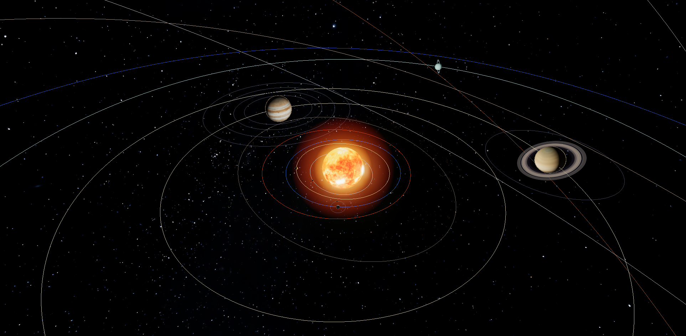

# 🌌 3D Solar System — Interactive Orrery

An interactive, scientifically grounded 3D model of the Solar System, built with
[three.js](https://threejs.org). Planet positions are computed from real
**NASA/JPL J2000 Keplerian orbital elements**, so the alignment of the planets
matches whatever date you choose.



## ▶ How to run

The app loads ES modules and texture images, so it must be served over HTTP
(opening `index.html` directly with `file://` is blocked by the browser).
A tiny zero-dependency server is included:

```bash
python server.py            # then open http://127.0.0.1:8000/
# or choose a port:  python server.py 5500
```

Any static server works too, e.g. `npx serve` or VS Code's *Live Server*
extension. Then open the printed URL in a modern browser (Chrome, Edge, Firefox).

## ✨ Features

- **Realistic orbits** — elliptical paths from J2000 orbital elements (eccentricity,
  inclination, ascending node, perihelion) solved with Kepler's equation each frame.
- **The Sun** with an HDR bloom glow and a point light that illuminates the planets.
- **All 8 planets + Pluto** with NASA textures, correct relative sizes, axial tilts,
  and physically accurate rotation periods (including retrograde spins).
- **Earth** uses a custom day/night shader (city lights on the dark side), a separate
  cloud layer, and an atmospheric rim glow.
- **Ring systems** — Saturn (textured) and Uranus (near-vertical, from its 98° tilt).
- **7 major moons** — the Moon, the four Galilean moons, Titan and Triton.
- **Asteroid & Kuiper belts** — thousands of GPU-instanced bodies on Keplerian orbits.
- **Voyager 1 & 2** — the real NASA 3D model placed at the probes' **live, real-time
  positions**, propagated from NASA/JPL HORIZONS heliocentric state vectors. They appear
  only in the **Realistic** / **Accurate · live** views (their true distance is 140–170 AU),
  drawn as a screen-relative gizmo so a metre-scale craft stays findable, with live
  distance, one-way light-time and speed in the info panel.
- **Milky Way skybox** plus a scattered starfield.
- **Time controls** — play/pause, reverse, a logarithmic speed slider (real-time up to
  ~10 years/second), presets, "jump to date", and a live simulation clock.
- **Exploration** — click or use the left list to select; double-click / *Focus & follow*
  to track a body; toggle orbits, labels, moons, belts, bloom, and distance scale.
- **Detailed info panels** for every body — physical data, orbital data, and fun facts.
- **Eclipse modes** (top bar ▸ *🌒 Eclipses*):
  - **Solar eclipse** — a 3D Sun–Moon–Earth alignment with the Moon's tilted
    orbital path, umbra/penumbra shadow cones, plus a *"View from Earth's surface"*
    render (using the real Sun texture) showing the Moon crossing the
    Sun, the crescent phases, the **corona at totality**, and a **Total ↔ Annular
    ("ring of fire")** toggle.
  - **Lunar eclipse** — Earth's shadow sweeping across the Moon in 3D, with the POV
    view of the Moon dimming and turning into a coppery **"Blood Moon"**.
  - Both include a timeline scrubber, a live phase readout, and detailed descriptions.

## 🎮 Controls

| Action | How |
| --- | --- |
| Rotate | Left-click drag (one finger on touch) |
| Zoom | Scroll wheel, or **pinch with two fingers** on touch |
| Pan | Right-click drag (two-finger drag on touch) |
| Fly the viewpoint | **W A S D** / arrow keys to move through space; **R / F** for up / down |
| Accurate · live mode | View ▸ Distance scale ▸ *Accurate* — true NASA/JPL positions, the whole system drifts through space leaving a motion trail per planet (orbit paths auto-hidden) |
| Voyager probes | Switch to *Realistic* or *Accurate · live*, then pick **Voyager 1 / 2** from the left list (or *View ▸ Spacecraft*) to see their live positions far beyond the planets |
| Select a body | Click it, click its label, or pick from the left list |
| Focus & follow | Double-click a body, pick from the list, or press *Focus & follow* |
| Pause / resume | `Space` |
| Stop following | `Esc` |

## 📁 Project structure

```
index.html        Markup, import map, UI containers
server.py         Tiny static file server (correct JS MIME types)
css/style.css     UI styling
js/data.js        Orbital elements + physical data & facts for every body
js/kepler.js      Orbital mechanics (Kepler solver, distance scaling)
js/bodies.js      Builds all 3D objects and updates them each frame
js/main.js        Renderer, camera, controls, bloom, picking, the sim loop
js/ui.js          Body navigator, time controls, toggles, info panel
js/eclipse.js     Solar & lunar eclipse modes (3D rig + "view from Earth" canvas)
lib/              three.js r160 + addons (local copies, no CDN needed; incl. GLTFLoader)
models/           Voyager.glb — NASA's public-domain Voyager 3D model
textures/         Planet / moon / ring / star textures
```

## 🛰 A note on scale

The real Solar System is mostly empty space. The default **Compressed** view shrinks the
distances (and the Sun) so every planet is visible together. **Realistic** and
**Accurate · live** (View ▸ Distance scale) instead show everything **fully true to
scale**: bodies and the distances between them share one ruler, so the Sun's true
diameter spans about 1/107 of Earth's orbit — exactly as in reality. At that scale the
Sun is a tiny dot and the planets are specks separated by vast emptiness, so use *Focus &
follow* and the WASD fly controls to explore (a logarithmic depth buffer keeps everything
from a close-up moon to the far dwarf planets rendering cleanly).

## 📜 Credits

- Planetary & star textures © [Solar System Scope](https://www.solarsystemscope.com/textures) — licensed **CC BY 4.0**.
- Orbital elements: **NASA/JPL** (J2000.0 epoch).
- Voyager 3D model: **NASA/VTAD** ([science.nasa.gov](https://science.nasa.gov/resource/voyager-3d-model/)) — public domain.
- Voyager positions: **NASA/JPL HORIZONS** heliocentric ecliptic state vectors, linearly propagated.
- Rendering: [three.js](https://threejs.org) r160.
