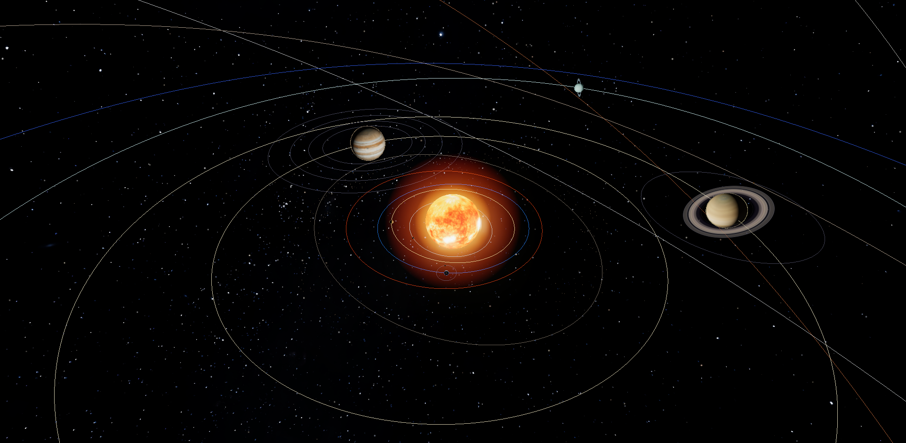

# 🌌 3D Solar System — Interactive Orrery

An interactive, scientifically grounded Solar System visualization built with
[three.js](https://threejs.org). Choose a date, explore planets and moons, compare
compressed and true-scale views, follow Voyager 1 and 2, or step through solar
and lunar eclipse visualizations.

[Live demo](https://buithethuat03.github.io/solar-system/) ·
[Web Usage Guide](docs/web-usage.md)



## Highlights

- **Date-aware planetary positions** computed by solving Kepler's equation from
  NASA/JPL J2000 orbital elements and secular rates.
- **The Sun, all eight planets, and five dwarf planets**: Pluto, Ceres, Haumea,
  Makemake, and Eris.
- **Seven major moons**: Earth's Moon, Io, Europa, Ganymede, Callisto, Titan,
  and Triton, shown on simplified near-circular orbits.
- **Detailed rendering** with relative body sizes, axial tilts, prograde and
  retrograde rotation, Saturn and Uranus rings, atmospheres, a photographic
  Milky Way, and selective HDR bloom around the Sun.
- **Earth day/night rendering** with city lights, ocean specular highlights,
  a separate cloud layer, and atmospheric rim glow.
- **Asteroid and Kuiper belts** containing 4,800 GPU-instanced bodies moving on
  simplified circular paths with Keplerian periods.
- **Voyager 1 and 2 trajectories** from embedded NASA/JPL HORIZONS heliocentric
  state vectors, with date-aware distance, one-way light-time, and speed data.
- **Time travel controls** from real time to about ten simulated years per
  second, including reverse playback, presets, UTC date selection, and Now.
- **Three distance views**: an approachable compressed overview and two views
  where body sizes and interplanetary distances share one true-scale ruler.
- **Solar and lunar eclipse modes** with a 3D teaching rig, shadow cones, an
  Earth-surface point of view, timeline controls, phase readouts, total/annular
  solar options, corona effects, and a copper-red lunar totality.
- **English and Vietnamese UI**, standard and high-resolution (up to 8K)
  texture choices, fullscreen mode,
  mouse/touch navigation, and keyboard flight controls.

For a full walkthrough of the interface, controls, view modes, Voyager probes,
and eclipse tools, see the [Web Usage Guide](docs/web-usage.md).

## Quick start

This is a static ES-module app with no package installation or build step. Run
the included server from the repository root:

```bash
python server.py
```

Then open <http://127.0.0.1:8000/>. To use another port:

```bash
python server.py 5500
```

The app must be served over HTTP; opening `index.html` directly with `file://`
prevents the browser from loading its modules and assets correctly.

### Requirements

- A modern browser with WebGL and ES-module/import-map support.
- Python 3 only if you use the included local server. Any correctly configured
  static HTTP server can host the project.

three.js r160 and its required addons are included under `lib/`. Planet, moon,
sky, and spacecraft assets are also stored in the repository; no runtime package
manager is required.

## Controls

| Action | Control |
| --- | --- |
| Rotate | Left-drag; one-finger drag on touch |
| Zoom | Mouse wheel; two-finger pinch on touch |
| Pan | Right-drag; two-finger drag on touch |
| Fly through space | `W` `A` `S` `D` or arrow keys; `R`/`F` move up/down |
| Inspect an object | Single-click the body or its label |
| Focus and follow | Double-click a body, double-click/double-tap its label, choose it in the navigator, or use **Focus & follow** |
| Play or pause | `Space` or the play/pause button |
| Stop following | `Esc` or **Stop following** |
| Reset the camera | **Reset view** |

Keyboard flight speed adapts to the current zoom level. Manual flight stops an
active follow. In an eclipse view, `Space` controls the eclipse timeline and
`Esc` returns to the orrery.

## Distance views

| Mode | What it shows |
| --- | --- |
| **Compressed** | Nonlinear orbital spacing, a smaller Sun, and enlarged tiny dwarf planets so the system remains easy to survey. |
| **Realistic** | Body radii, moon distances, and heliocentric distances on one true-scale ruler. Voyager spacecraft become available. |
| **Accurate · live** | The same true-scale orbital model, reset to the current date, plus a stylized shared drift and motion-trail visualization. Orbit paths are disabled in this mode. |

The Accurate-mode drift is a visual device for showing motion through space; it
is not an absolute galactic ephemeris. Switching modes also reframes the camera
because the compressed and true-scale scenes differ by orders of magnitude.

## Project structure

```text
index.html              Page structure, import map, and UI containers
server.py               Zero-dependency local static server with module MIME types
web.config              Optional IIS static-site/MIME configuration
css/style.css           Application, responsive, fullscreen, and eclipse styling
js/main.js              Renderer, camera, picking, simulation loop, and controllers
js/bodies.js            Scene objects, materials, belts, trails, and Voyager models
js/data.js              Orbital, physical, descriptive, moon, belt, and probe data
js/kepler.js            Planet solver, distance mapping, and Voyager interpolation
js/voyager_ephem.js     Generated embedded NASA/JPL HORIZONS state-vector samples
js/ui.js                Navigator, time controls, view settings, and info panel
js/eclipse.js           Solar/lunar eclipse teaching rigs and POV rendering
js/i18n*.js             English/Vietnamese interface and body translations
js/fullscreen.js        Browser fullscreen/UI synchronization
lib/                    Local three.js r160 module and required addons
models/Voyager.glb      NASA Voyager 3D model
textures/               Standard and high-resolution texture sets
docs/                   Preview image and end-user documentation
tools/                  Voyager ephemeris generator and focused Node checks
```

## Scientific and technical notes

- The eight planets use the JPL approximate-position element/rate model, whose
  documented range is approximately 1800–2050. Pluto uses the long-term element
  set; the other dwarf planets use fixed J2000-derived elements. Dates outside
  those ranges still render, but should not be treated as precision ephemerides.
- Moon paths are simplified near-circular parent-relative orbits. Belt particles
  use simplified circular paths and Kepler's third law.
- Voyager samples use the HORIZONS J2000 ecliptic, Sun-centered frame. The app
  interpolates the stored positions and velocities with cubic Hermite curves;
  dates beyond the final table samples (about 2055) use constant-velocity
  extrapolation. No live network request is made when the app runs.
- Voyager models remain at physical metre scale on the true-scale scene ruler.
  A label helps locate them, and origin rebasing preserves enough precision to
  inspect them far from the Sun.
- Eclipse modes are explanatory simulations with didactic scale and geometry,
  not predictions tied to the selected calendar date.
- A logarithmic depth buffer supports the enormous range from close-up moons and
  metre-scale spacecraft to distant dwarf planets.

## A note on scale

The real Solar System is mostly empty space. **Compressed** mode deliberately
changes distances and selected display sizes so the major bodies fit in one
view. In **Realistic** and **Accurate · live**, one scene ruler is shared by body
radii and distances: the Sun's true diameter spans about 1/107 of Earth's orbital
radius. The Sun therefore looks tiny and planets are separated by large empty
gaps. Use the navigator, **Focus & follow**, and keyboard flight to explore.

## Data sources and credits

- Planetary and star textures © [Solar System Scope](https://www.solarsystemscope.com/textures),
  licensed under **CC BY 4.0**.
- Pluto and major-moon maps: NASA/JHUAPL/SwRI and USGS Astrogeology, public-domain
  sources as credited in the project data.
- Planetary orbital elements: **NASA/JPL**, J2000 approximate-position datasets.
- Voyager trajectories: **NASA/JPL HORIZONS**, heliocentric J2000 ecliptic state
  vectors embedded in the project.
- Voyager model: **NASA/VTAD** — [Voyager 3D Model](https://science.nasa.gov/resource/voyager-3d-model/),
  public domain.
- Rendering: [three.js](https://threejs.org) r160.
